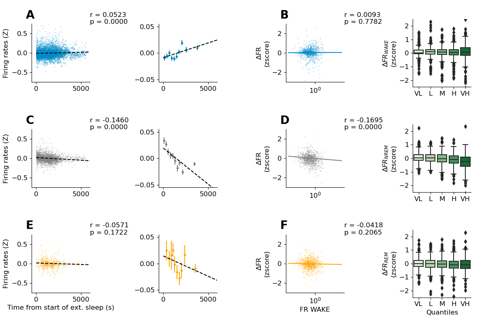

Generating figure |fignum|: Firing rates in the BLA are homeostaticaly regulated during NREM sleep.
===================================================================================================

Overview
--------

To generate figure |fignum| one needs to:

1. Execute :py:mod:`~processing.fr_states` :

.. code-block:: bash
   :linenos:

   python processing/fr_states.py

This will load, session by session, the data set and compute the firing rates of neurons across extended sleep and extended wake periods. 

1. Execute :py:mod:`~plots.plot_delta_fr`

.. code-block:: bash
   :linenos:

   python plots/plot_fr.py

This will generate svg + png figures in files in plots/figures.

Details
--------

fr_states.py calls :py:func:`~processing.fr_states.process_all_sessions` with following parameters :

* base_folder : Folder of the dataset.
* params : a dict that contains parameter specific to extended wake and extended sleep. 
   * State : compute extended period of 'wake' or 'sleep'
   * sleep_th : minimal or maximum amount of time in sleep (minutes)
   * wake_th : minimal or maximal amount of time in wake (minutes)
   * sub_states : Compute the firing rates for separate substates (NREM/REM for instance)
* save : a boolean in order to save every session to a shelve.

:py:func:`~processing.fr_states.process_all_sessions` calls :py:func:`~processing.fr_states.process_session`.

:py:func:`~processing.fr_states.process_session` proced to save each session :

* In a shelves located at processed_data/network_metrics with a json files with the parameters
* In CSV files :
   * delta_extended.csv/json 
   * rem_on.csv/json
   * states_fr.csv/json
 
:py:func:`~processing.fr_states.process_all_sessions` will also save merged processed data after running :py:func:`~processing.fr_states.merge_extended`

Once processing done, :py:mod:`~plots.plot_delta_fr` will generates the figure.

Panel table
-----------
#FIXME TABLE

.. list-table::
   :header-rows: 1

   * - figure
     - panel
     - function
     - parameters
   * - |fignum|
     - A
     - :py:func:`~plots.plot_delta_fr.plot_fr_across_extended`
     - extended['merged_sessions'],stru,'Pyr',ax[:3,:2]
   * - |fignum|
     - B-Left
     - :py:func:`~plots.plot_fr.plot_corr_fr_delta`
     - df_firing_rates,df_delta_es,stru,ax[:,2]
   * - |fignum|
     - B-Right
     - :py:func:`~plots.plot_fr.plot_boxplot_delta_quintiles`
     - df,'delta_WAKE_HOMECAGE','BLA',ax = ax[0,3]
   * - |fignum|
     - C
     - :py:func:`~plots.plot_fr.plot_fr_across_extended`
     - extended['merged_sessions'],stru,'Pyr',ax[:3,:2]
   * - |fignum|
     - D-Left
     - :py:func:`~plots.plot_fr.plot_corr_fr_delta`
     - df_firing_rates,df_delta_es,stru,ax[:,2]
   * - |fignum|
     - D-Right
     - :py:func:`~plots.plot_fr.plot_boxplot_delta_quintiles`
     - df,'delta_NREM','BLA',ax = ax[1,3]
   * - |fignum|
     - E
     - :py:func:`~plots.plot_fr.plot_fr_across_extended`
     - extended['merged_sessions'],stru,'Pyr',ax[:3,:2]
   * - |fignum|
     - F-left
     - :py:func:`~plots.plot_fr.plot_corr_fr_delta`
     - df_firing_rates,df_delta_es,stru,ax[:,2]
   * - |fignum|
     - F-Right
     - :py:func:`~plots.plot_fr.plot_boxplot_delta_quintiles`
     - df,'delta_REM','BLA',ax = ax[2,3]

Figures
--------

    
  Figure |fignum|. Firing rates in the BLA are homeostaticaly regulated during NREM sleep.

(A) Correlation between time spent in wake and average firing rates in the BLA. Left: All data points are shown. ( r = 0.052 ,
p = 4.1 × :math:`10^{−5}` ). Right: Same as Left but data points are group in 10 same sized group. Error bar shows SEM. (B) Left:
correlation between the average firing rates during wakefulness and the delta of firing between the beginning of extended wake
and the end. ( r = 0.01, p = 0.78 ). Right: Boxplot of delta FR during EWE whith neurons divided by quintile based on WAKE firing
rates. (Signrank test against 0, Bonferonni correction) N > 200 neurons in each quantile (C,D,E,F) same as (A,B) but for NREM
and REM sleep. Correlation with time spent in NREM or REM ( r = −0.15, p = 4.05 × :math:`10^{−13}` ; r = −0.06, p = 0.17 ). Correlation
with wake firing rates and delta during NREM or REM ( r = −0.17, p = 2.44 ×  :math:`10^{-7}` ; r = −0.04, p = 0.21 ). Neurons that fire the
most during wake are the one that decrease the most during NREM sleep.

.. |fignum| replace:: 4
