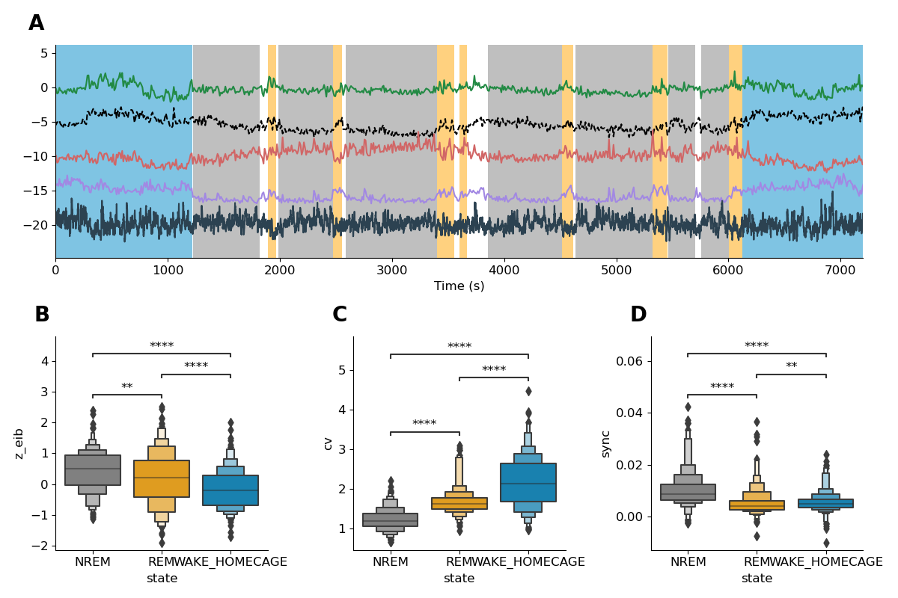

Generating figure |fignum|: BLA is highly active during REM sleep
==========================================================

Overview
--------

To generate figure |fignum| one needs to:

1. Execute processing/network_metrics.py : 

.. code-block:: bash
   :linenos:

   python processing/network_metrics.py

This will load, session by session, the data set and compute EIB CV and Sync for the whole session.

1. Execute plots/plot_network_metrics.py

.. code-block:: bash
   :linenos:

   python plots/plot_network_metrics.py

This will generate an svg in files in plots/figures. 

Details
--------

network_metrics.py calls :py:func:`~processing.network_metrics.process_all_sessions` with following parameters :

* base_folder : Folder of the dataset.
* save : a boolean in order to save every session to a shelve.
* force : a boolean in order to force recomputations.

:py:func:`~processing.network_metrics.process_all_sessions` calls :py:func:`~processing.network_metrics.process_session`.

:py:func:`~processing.network_metrics.process_session` proced to save each session :

In a shelves located at processed_data/binned_fr_extended with a json files with the parameters
 
:py:func:`~processing.fr_states.process_all_sessions` will also save merged processed data after running :py:func:`~processing.fr_states.merge_extended`

Once processing done, :py:mod:`~plots.plot_network_metrics` will generates the figure.

Figures
-------

   Figure |fignum|. The basolateral-amygdala is highly active during REM sleep.

   (A) Boxplot representing the firing rates of each recorded neurons in the BLA (n = 1777 principal neurons and n = 260
   interneurons). Firing rates are different for each states with higher firing rates during REM for both principal and interneurons.
   (wilcoxon sign ranked test). (B) Same as (A) but represented as cumulative distributions. Left represent principal neurons and
   right interneurons. Log-scale is used to represent principal neurons as they span a larger band of firing rates. (C) Histogram of
   firing rates during WAKE. Red lines shows quintiles cutoff. (D) Zscore firing rates of principal and interneurons at NREM-REM. Top
   panel shows raw firing rates. Bottom panel shows Zscore firing rates separated in quintiles based on WAKE mean firing rates (n =
   283 NREM-REM transitions ; n = 1777 principal neurons ; n = 260 interneurons). (E) 55.7% of principal and 72.0% of interneurons
   are REM-ON cells (poisson-test against firing during NREM, p < 0.001). (F) Linear regression between increase of firing rates
   during REM sleep and firing rates during WAKE. Principal neurons that fires the most during WAKE tends to increase less during
   REM sleep (r = −0.20, p = 5.66 × 10−17  ). Interneurons increase does not depends on WAKE firing rates (r = −0.02, p = 0.76)
   (G) Same as (F) but neurons a grouped by quintiles based on average firing rates during WAKE. (Kruskal-Wallis p < 10-33 followed
   by Mann-Whitney with Bonferroni correction).

Panel table
-----------

.. list-table::
   :header-rows: 1

   * - figure
     - panel
     - function
     - parameters
   * - |fignum|
     - A
     - :py:func:`~plots.plot_fr.boxenplot_firing_rates`
     - df,"BLA",axes
   * - |fignum|
     - B
     - :py:func:`~plots.plot_fr.cumsum_curves_firing_rates`
     - df,"BLA",['NREM','REM','WAKE_HOMECAGE'],axes
   * - |fignum|
     - B
     - :py:func:`~plots.plot_fr.cumsum_curves_firing_rates`
     - df,"BLA",['NREM','REM','WAKE_HOMECAGE'],axes
   * - |fignum|
     - C
     - :py:func:`~plots.plot_fr.plot_histograms_firing_rates`
     - df,"BLA",quantile_state,axes
   * - |fignum|
     - D-top
     - :py:func:`~plots.plot_fr.plot_transitions_panel`
     - transitions,df,stru,None,None,params,NREM-REM,axes
   * - |fignum|
     - D-bot
     - :py:func:`~plots.plot_fr.plot_transitions_panel`
     - transitions,df,stru,zscore,quantile_state,params,NREM-REM,axes
   * - |fignum|
     - E
     - :py:func:`~plots.plot_fr.proportion_rem_on`
     - rem_on_off,"BLA",axes
   * - |fignum|
     - F
     - :py:func:`~plots.plot_fr.corr_rem_nrem_fr`
     - df,"BLA","WAKE_HOMECAGE",axes
   * - |fignum|
     - G
     - :py:func:`~plots.plot_fr.corr_rem_nrem_fr`
     - df,"BLA","WAKE_HOMECAGE",axes

.. |fignum| replace:: 5