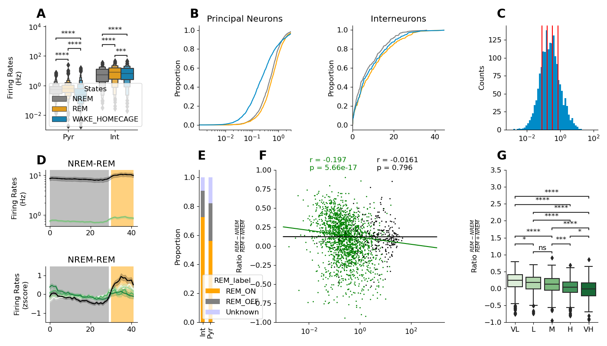
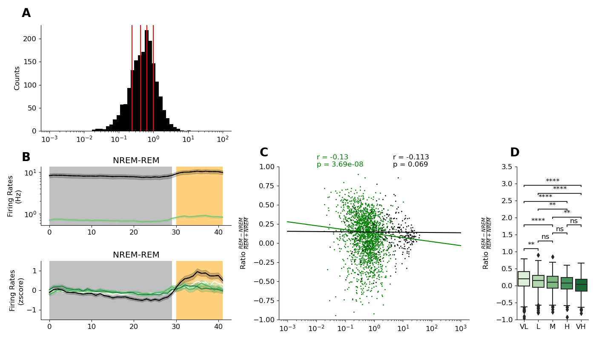

Generating figure 2: BLA is highly active during REM sleep
==========================================================

Overview
--------

To generate figure 2 one needs to:

1. Execute processing/fr_states.py : 

.. code-block:: bash
   :linenos:

   python processing/fr_states.py

This will load, session by session, the data set and compute firing rates of all the neurons with various conditions.

2. Execute plots/plot_fr.py

.. code-block:: bash
   :linenos:

   python plots/plot_fr.py

This will generate an svg in files in plots/figures. 

Details
--------

fr_states.py calls :py:func:`~processing.fr_states.process_all_sessions` with following parameters :

* base_folder : Folder of the dataset.
* params : a dict that contains parameter specific to extended wake and extended sleep. 
   * State : compute extended period of 'wake' or 'sleep'
   * sleep_th : minimal or maximum amount of time in sleep (minutes)
   * wake_th : minimal or maximal amount of time in wake (minutes)
   * sub_states : Compute the firing rates for separate substates (NREM/REM for instance)
* save : a boolean in order to save every session to a shelve.

:py:func:`~processing.fr_states.process_all_sessions` calls :py:func:`~processing.fr_states.process_session`.

:py:func:`~processing.fr_states.process_session` proced to save each session :

* In a shelves located at processed_data/binned_fr_extended with a json files with the parameters
* In CSV files :
   * delta_extended.csv/json 
   * rem_on.csv/json
   * states_fr.csv/json
 
:py:func:`~processing.fr_states.process_all_sessions` will also save merged processed data after running :py:func:`~processing.fr_states.merge_extended`

Once processing done, :py:mod:`~plots.plot_fr` will generates the figure.
Variable quantile_state, will define if neurons are sorted base on firing rates during WAKE or SLEEP.

Figures
-------

   Figure 2. The basolateral-amygdala is highly active during REM sleep.

   (A) Boxplot representing the firing rates of each recorded neurons in the BLA (n = 1777 principal neurons and n = 260
   interneurons). Firing rates are different for each states with higher firing rates during REM for both principal and interneurons.
   (wilcoxon sign ranked test). (B) Same as (A) but represented as cumulative distributions. Left represent principal neurons and
   right interneurons. Log-scale is used to represent principal neurons as they span a larger band of firing rates. (C) Histogram of
   firing rates during WAKE. Red lines shows quintiles cutoff. (D) Zscore firing rates of principal and interneurons at NREM-REM. Top
   panel shows raw firing rates. Bottom panel shows Zscore firing rates separated in quintiles based on WAKE mean firing rates (n =
   283 NREM-REM transitions ; n = 1777 principal neurons ; n = 260 interneurons). (E) 55.7% of principal and 72.0% of interneurons
   are REM-ON cells (poisson-test against firing during NREM, p < 0.001). (F) Linear regression between increase of firing rates
   during REM sleep and firing rates during WAKE. Principal neurons that fires the most during WAKE tends to increase less during
   REM sleep (r = −0.20, p = 5.66 × 10−17  ). Interneurons increase does not depends on WAKE firing rates (r = −0.02, p = 0.76)
   (G) Same as (F) but neurons a grouped by quintiles based on average firing rates during WAKE. (Kruskal-Wallis p < 1033 followed
   by Mann-Whitney with Bonferroni correction).

      
  Figure S3. Firing Rates in the BLA at transitions.

  (A) Histogram of firing rates during SLEEP (NREM+REM). Red lines shows quintiles cutoff. (B) Same as Fig. 2D but quintiles
  are compute on SLEEP firing rates. (C,D) Same as Fig. 2F,G but x-axis is firing rates during SLEEP

Panel table
-----------

.. list-table::
   :header-rows: 1

   * - figure
     - panel
     - function
     - parameters
   * - 2
     - A
     - :py:func:`~plots.plot_fr.boxenplot_firing_rates`
     - df,"BLA",axes
   * - 2
     - B
     - :py:func:`~plots.plot_fr.cumsum_curves_firing_rates`
     - df,"BLA",['NREM','REM','WAKE_HOMECAGE'],axes
   * - 2
     - B
     - :py:func:`~plots.plot_fr.cumsum_curves_firing_rates`
     - df,"BLA",['NREM','REM','WAKE_HOMECAGE'],axes
   * - 2
     - C
     - :py:func:`~plots.plot_fr.plot_histograms_firing_rates`
     - df,"BLA",quantile_state,axes
   * - 2
     - D-top
     - :py:func:`~plots.plot_fr.plot_transitions_panel`
     - transitions,df,stru,None,None,params,NREM-REM,axes
   * - 2
     - D-bot
     - :py:func:`~plots.plot_fr.plot_transitions_panel`
     - transitions,df,stru,zscore,quantile_state,params,NREM-REM,axes
   * - 2
     - E
     - :py:func:`~plots.plot_fr.proportion_rem_on`
     - rem_on_off,"BLA",axes
   * - 2
     - F
     - :py:func:`~plots.plot_fr.corr_rem_nrem_fr`
     - df,"BLA","WAKE_HOMECAGE",axes
   * - 2
     - G
     - :py:func:`~plots.plot_fr.corr_rem_nrem_fr`
     - df,"BLA","WAKE_HOMECAGE",axes

