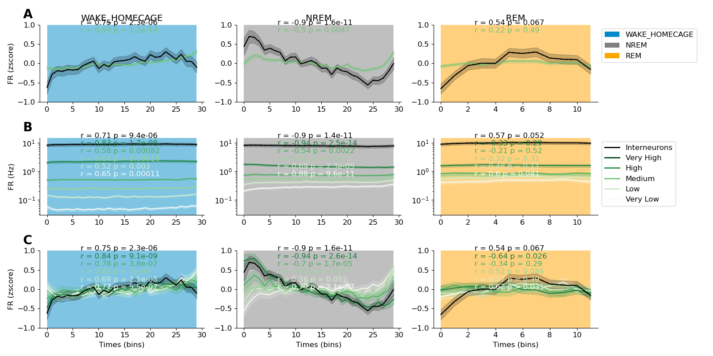
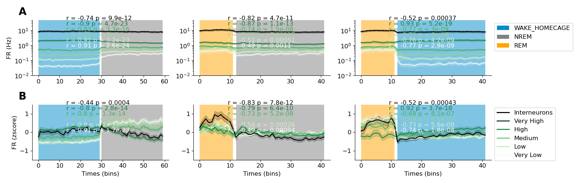
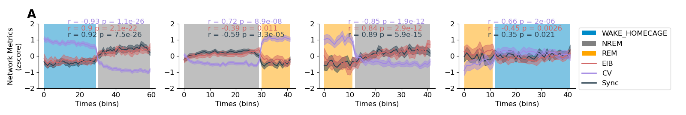

Generating Figure 3. The firing rates of pyramidal cells and interneurons increase during wake and decrease during NREM
=======================================================================================================================

Overview
--------

To generate figure 2 one needs to:

1. Execute processing/transitions.py : 

.. code-block:: bash
   :linenos:

   python processing/transitions.py

This will load, session by session, the data set and compute firing rates of all the neurons for all transitions.

1. Execute plots/plot_fr.py

.. code-block:: bash
   :linenos:

   python plots/plot_transitions.py

This will generate an svg in files in plots/figures. 

Details
--------

transitions.py calls :py:func:`~processing.transitions.process_all_sessions` with following parameters :

* base_folder : Folder of the dataset.
* params : a dict that contains parameter specific to extended wake and extended sleep. 
   * State : compute extended period of 'wake' or 'sleep'
   * sleep_th : minimal or maximum amount of time in sleep (minutes)
   * wake_th : minimal or maximal amount of time in wake (minutes)
   * sub_states : Compute the firing rates for separate substates (NREM/REM for instance)
* save : a boolean in order to save every session to a shelve.

:py:func:`~processing.fr_states.process_all_sessions` calls :py:func:`~processing.fr_states.process_session`.

:py:func:`~processing.fr_states.process_session` proced to save each session :

In a shelves located at processed_data/binned_fr_extended with a json files with the parameters
:py:func:`~processing.fr_states.process_all_sessions` will also save merged processed data after running :py:func:`~processing.fr_states.merge_extended`

Once processing done, :py:mod:`~plots.plot_transitions` will generates the figure.
Variable quantile_state, will define if neurons are sorted base on firing rates during WAKE or SLEEP.

Figures
--------

    
    Figure 3. Neurons decrease firing rates during NREM and increase firing rates during WAKE
    (A) Average firing rates of neurons during NREM sleep, REM sleep, and wake epochs. (B) Firing rates of principal neurons
    (green) categorized into quintiles based on their average firing rates during wake epochs. (C) Same as (B), but firing rates are
    z-scored. Interneurons are represented in black. Shaded Area represent 95% CI. (n = 514 wake epochs ; n = 688 NREM epochs
    ; n = 431 REM epochs) (pValue are corrected by Bonferroni (n = 21 test)). Correlation statistics were computed after averaging
    the firing rates by quintiles.

    
    Figure S2. Firing Rates in the BLA at transitions
    (A) Raw firing rates at WAKE-NREM / REM-NREM and REM-WAKE transitions. Panel show raw firing rates averaged by quintiles.
    (B) same as (A) but the firing rates of neurons are zscored.

    
    Figure S6. Network metrics at different transitions
    (A) Measure of network metrics at WAKE-NREM / NREM-REM / REM-NREM and REM-WAKE transitions

Panel table
-----------

.. list-table::
   :header-rows: 1

   * - figure
     - panel
     - function
     - parameters
   * - 3
     - A,B,C
     - :py:func:`~plots.plot_transitions.fig3_firing_rates_epochs`
     - transitions,network_metrics_transitions,df_firing_rates,params,quantile_state
   * - S2
     - A,B
     - :py:func:`~plots.plot_transitions.figs2_firing_rates_transitions`
     - transitions,network_metrics_transitions,df_firing_rates,params,quantile_state
   * - S6
     - A
     - :py:func:`~plots.plot_transitions.figs6_network_metrics_transitions`
     - transitions,network_metrics_transitions,df_firing_rates,params,quantile_state